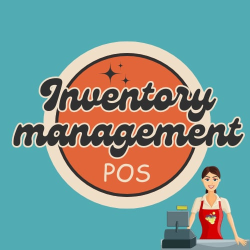
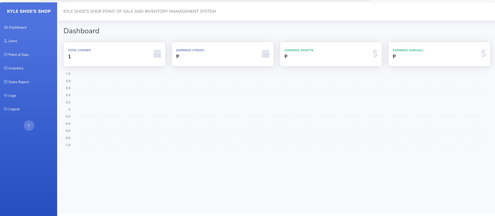
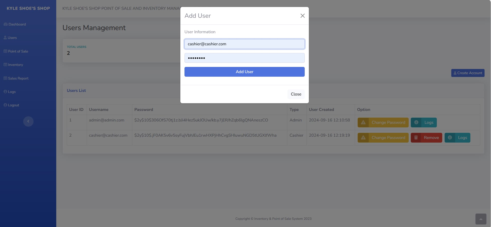
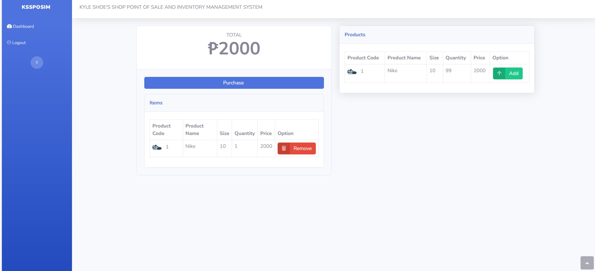
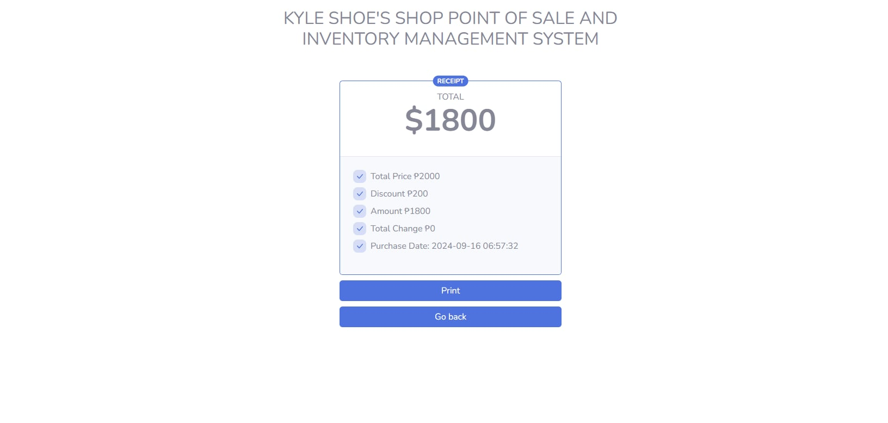

use# SD-3101 [Point of Sale and Inventory Management System]



## Table of Contents
- [Introduction](#introduction)
- [Project Overview](#project-overview)
- [Objectives](#objectives)
- [Features](#features)
- [Technologies Used](#technologies-used)
- [Setup and Installation](#setup-and-installation)
- [Usage Instructions](#usage-instructions)
- [Project Structure](#project-structure)
- [Contributors](#contributors)
- [Chagelog](#changelog)
- [Acknowledgments](#acknowledgments)
- [License](#license)

---

## Introduction
   Point of sale and Inventory management is a web-based system that provides E-commerce simple inventory management. It focuses on streamlining online business operations by integrating sales processing and inventory tracking in real-time. 
   

## Project Overview
The retail industry rapidly evolving and businesses continuously find ways to deliver their services to stay competitive. traditionally, sales and inventory managed manually using paper and pen transactions which is prone to errors, inconsistecy and theft. with the help of technology, online business depends on Point of Sale and Inventory Managament to automate and centralize these problem. These system provides a more efficient sales processing, accurate inventory control, and valuable insights for decision-making.

The purpose of this project is to develop an extensive (POS) Point of Sale Inventory Management that serves as a tool in the field of E-business. allowing them to efficiently manage sales and inventory, reduce operational costs, and enhance customer experience.


- The target audience/user of this system are retail businesses, E-Commerce and other Service-based businesses .
- Real-world applications: retail stores, e-commerce/omnichannels retailers, Employee 
- Potential impacts: 
   - Operational Efficiency: Businesses may concentrate on expansion and customer interaction by automating sales and inventory administration, which also saves time and minimizes human mistake.
   -  Informed Decision-Making: The system provides valuable data insights, helping business owners make informed decisions about product pricing, stock levels, customer preferences, and supplier relationships. 
   - Improved Customer Experience: The system speeds up transactions, reduces checkout waiting times, and offers personalized services through CRM features. 
   - Cost Savings: By tracking inventory more accurately, businesses can avoid overstocking or understocking, reducing unnecessary holding costs or lost sales due to stock shortages. 
   - Security and Fraud Prevention: By controlling access to different system functionalities and providing audit trails for transactions, the system enhances security. It helps minimize employee theft and provides detailed transaction logs, ensuring transparency.
   


## Objectives
The aim of this project is to develop an extensive (POS) Point of Sale Inventory Management that can serves as a tool in terms of E-business operation that involves the following:

- Enhance the features of the system.
- Develop solution for more easy and smooth transactions without errors.
- Test and validate the new features we added. 

## Features
List the main features of the project:

Admin-side:
   - Dashboard: Dashboard contains the overall earnings (Today, monthly and annual) and total cashier.
   - User Management: Admin and User(Cashier) including their username, password and type of user.
   - Point of sale: it contains the main function of the system.
   - Inventory management : contains the total number of product, product list and stock-in, stock-out, update, remove option.
   - Sales Report : it contains the report of earnings for today, monthly and annual sales. including the transaction ID, User Id, total amount of purchased, discounted price, amount, discounted total and transaction created. 
   - System logs : it contains all the inventory and user log including the type of user, real-time sign-in and sign-out and when the Data is created.
  

Cashier-side:

   - Dashboard : It contains the main functions of the system, such as adding a product to your e-cart. The system will then ask for purchase confirmation, after which the cashier will input the discount percentage and amount. 
   - Receipt : Once submitted, you will receive an official receipt from the store.

New Features:

   - Data Backup and Recovery : Regular backups and recovery options to prevent data loss.
   - Inventory Tracking : Real-time monitoring of stock levels and updates.
   - Stock Alerts : Notifications for low stock levels or inventory thresholds.
   - Role-Based Permissions : Customize access levels and permissions based on user roles (e.g., cashier, manager).
   


## Technologies Used
Mention the tools, frameworks, and technologies used in the project:
- Programming Languages: Php and JavaScript.
- Frameworks/Libraries: Express (Node.js),  Bootstrap
- Databases: MySQL
- Software used:XAMPP, Vscode
Browser used: Google Chrome, Microsoft Edge, Mozilla Firefox
Other Tools: HTML, node.js


## Setup and Installation
Step-by-step instructions for setting up the project locally.

1. **Clone the repository:**

Follow the instruction below for cloning project repository.


   ```bash
   1.1. git clone cd /path/to/your/local/disk
   ```
  create a folder in your localdisk and copy the path and paste on gitbash aplication.
  ```bash
   1.2. cd "C:\Clone repo"
   ``` 
   copy the link of the repository from github and use the "git clone" command. 
   ```bash
   1.3.  git clone "https://github.com/HashJProgramming/Point-of-Sale-and-Inventory-Management-System.git"
   ```


2. **Set up the project:**

   2.1. Install XAMPP aplication.

   2.2. Open the XAMPP and click Start Apache and MySQL.

   2.3. Click MySQL admin and it will automatically direct you to http://localhost/phpmyadmin/.

3. **Folder Directory Path:**
   
   3.1. Find Local Disk.

   3.2. Open Xampp folder.

   3.3. Under Xampp folder click htdocs folder and move the cloned-repository inside it. 

4. **Database Importation process:**

   4.1. at http://localhost/phpmyadmin/ click new.

   4.2. Under Database name type db_hash and click create.

   4.3. Click import and find in database folder the db_hash 5-19-2023. sql file and click import. 


5. **Run the project**

   5.1 To access the Admin page:

    ```bash
   http://localhost/system/Point-of-Sale-and-Inventory-Management-System/dashboard.php
    ```

    5.2. To access the Cashier(User) page:

    ```bash
   http://localhost/system/Point-of-Sale-and-Inventory-Management-System/point-of-sale.php
    ```


**Note:** If your project has external depencies like XAMPP, MySQL, special SDK, or other environemnt setup, create another section for it.

## Usage Instructions
Provide detailed instructions on how to use the project after setup:

1. **Admin Login**
   
Default:

   1.1. Username:
         
      - admin@admin.com

   1.2. Password:

      - admin123


**ADMIN PAGE**
-





2. **Cashier-User Login**
   
   - To create cashier account go to admin

   - Under User Management click Add user
   
   - Input username and password and click Add user button to create their account.

Example:

   2.1. Username:

      - cashier@cashier.com
   
   2.2. Password:

      - cashier123

**CASHIER-USER PAGE**
-



## Project Structure
Explain the structure of the project directory. Example:
```bash
.
.
└── C:/
    └── xampp/
        └── htdocs/
            └── system/
                └── Point-of-Sale-and-Inventory-Management-System/
                    ├── assets
                    ├── database
                    ├── functions
                    ├── screenshots
                    ├── 404
                    ├── dashboard
                    ├── index
                    ├── insufficient
                    ├── inventory
                    ├── LEARN
                    ├── LICENSE
                    ├── logs
                    ├── point-of-sale
                    ├── README
                    └── README (ORIGINAL COPY)           
```

## Contributors

List all the team members involved in the project. Include their roles and responsibilities:

- **Zandra Capistrano**: Lead Developer, Backend Developer
- **Shane C. Sabio**: Frontend Developer, UI/UX Designer
- **Gerald Villaran**: Project Manager, Tester

## Project Timeline

Outline the project timeline, including milestones or deliverables. Example:

- **Week 1-2**: Collaborative Brainstorming for Feature Development.
- https://m.youtube.com/watch?v=1TF_gqFCzKU
- Proposes Features
- DASHBOARD OVERVIEW
- PRODUCT MANAGEMENT
- STOCKS ALERT
- ORDER HISTORY
- **Week 3-5**: Designing the new features.
- **Week 6-10**: Implementation.
- **Week 11-12**: Testing and debugging.
- **Week 13-14**: Final presentation and documentation.

## Changelog

### [Version 1.0.0] - 2024-09-07
- Initial release of the project.
- Added basic functionality for [Feature 1], [Feature 2], and [Feature 3].

### [Version 1.1.0] - 2024-09-14
- Improved user interface for [Feature 1].
- Fixed bugs related to [Feature 2].
- Updated project documentation with setup instructions.

### [Version 1.2.0] - 2024-09-21
- Added new functionality for [Feature 4].
- Refactored codebase for better performance.
- Added unit tests for [Feature 3] and [Feature 4].


## Acknowledgments

Acknowledge any resources, mentors, or external tools that helped in completing the project.

This project was built from [Point-of-Sale-and-Inventory-Management-System](https://github.com/HashJProgramming), created by [Joshua Ambalong]. You can view the original repository [here](https://github.com/HashJProgramming/Point-of-Sale-and-Inventory-Management-System).

## License

Specify the project's license. For starters, adapt the license of the original repository.

MIT License

Copyright (c) 2023 Joshua Ambalong

Permission is hereby granted, free of charge, to any person obtaining a copy
of this software and associated documentation files (the "Software"), to deal
in the Software without restriction, including without limitation the rights
to use, copy, modify, merge, publish, distribute, sublicense, and/or sell
copies of the Software, and to permit persons to whom the Software is
furnished to do so, subject to the following conditions:

The above copyright notice and this permission notice shall be included in all
copies or substantial portions of the Software.

THE SOFTWARE IS PROVIDED "AS IS", WITHOUT WARRANTY OF ANY KIND, EXPRESS OR
IMPLIED, INCLUDING BUT NOT LIMITED TO THE WARRANTIES OF MERCHANTABILITY,
FITNESS FOR A PARTICULAR PURPOSE AND NONINFRINGEMENT. IN NO EVENT SHALL THE
AUTHORS OR COPYRIGHT HOLDERS BE LIABLE FOR ANY CLAIM, DAMAGES OR OTHER
LIABILITY, WHETHER IN AN ACTION OF CONTRACT, TORT OR OTHERWISE, ARISING FROM,
OUT OF OR IN CONNECTION WITH THE SOFTWARE OR THE USE OR OTHER DEALINGS IN THE
SOFTWARE.
